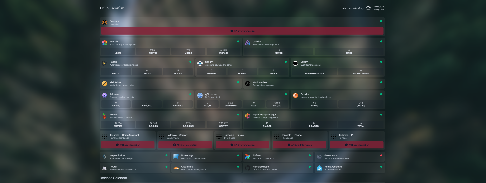

# Homepage Dashboard

My personal homelab dashboard built with [gethomepage.dev](https://gethomepage.dev).

> [!IMPORTANT]
> Tailscale and Proxmox API temporarily removed prior to taking the screenshot for privacy reasons. The setup in services.yaml is correct.

## Stack

| Category | Services |
|---|---|
| Infrastructure | Proxmox, Immich |
| Media | Jellyfin, Jellyseerr |
| Media Management | Radarr, Sonarr, Bazarr, Maintainerr |
| Downloads | qBittorrent, Prowlarr |
| Network | PiHole, Nginx Proxy Manager, Vaultwarden |
| VPN | Tailscale (5 nodes) |
| Automation | Airflow, Home Assistant |
| Misc | Cloudflare, Homelab Repo, Personal Site |

## Files

| File | Purpose |
|---|---|
| `services.yaml` | All service cards, widgets, and links |
| `settings.yaml` | Layout, row/column structure, card blur |
| `widgets.yaml` | Header widgets (greeting, datetime, weather) |
| `custom.css` | Font and spacing overrides |

## Setup

1. Install homepage — [official docs](https://gethomepage.dev/installation/)
2. Copy these files to your homepage config directory (usually `/opt/homepage/config/`)
3. Create a `secrets.env` in the same directory and fill in your values (see below)
4. Restart homepage

## Secrets

All sensitive values in `services.yaml` are marked with `## your ...` comments. Create a `secrets.env` or replace with static apis, usernames, passwords, etc:

## Customization

**Layout** — edit `settings.yaml` to change the number of columns per row or reorder groups.

**Adding a service** — add a new entry under the relevant group in `services.yaml`. Follow the existing structure. Widget types and fields are documented at [gethomepage.dev/widgets](https://gethomepage.dev/widgets/services/).

**Font & spacing** — edit `custom.css`. Currently uses [Cormorant Garamond](https://fonts.google.com/specimen/Cormorant+Garamond) for the header widgets.

**Weather location** — update `latitude`, `longitude` and `timezone` in `widgets.yaml`.
